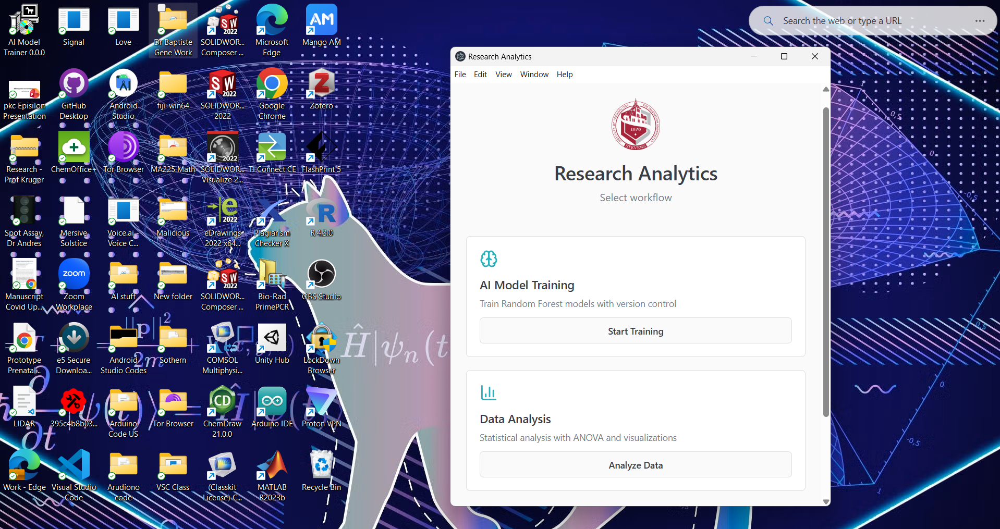

# Summary

This software provides a platform that combines machine learning and statistical analysis for chemical biology research, deployable as both a browser-based application and standalone desktop software. Researchers can upload CSV data, train Random Forest classification models with fully automated hyperparameter optimization, and perform comprehensive statistical tests through a unified interface requiring no programming expertise. The platform integrates data preprocessing, model training with version control, feature importance analysis, and interactive visualization (Figure 1), addressing the common workflow challenge of using multiple disconnected tools. Built with React 18.3 and TypeScript, it efficiently handles typical research datasets while allowing researchers to save and iteratively improve models through versioned training sessions. The complete implementation workflow from user interaction through model storage is illustrated in Figure 2.

# Statement of Need

Chemical and biomedical researchers routinely need to apply machine learning and statistics to experimental data, but existing tools create significant barriers. Powerful frameworks like scikit-learn [@Pedregosa2011] and R [@RCoreTeam2023] require programming expertise that many experimental scientists lack. Tools operate in isolation—researchers must manually transfer data between separate programs for statistical testing, machine learning, and visualization, reducing efficiency and introducing errors [@Baker2016].

This software addresses these gaps by providing both web-based and desktop applications that combine Random Forest classification [@Breiman2001] with standard statistical tests (t-tests, ANOVA, correlation) in one interface. The dual deployment model offers flexibility: researchers can use the browser version with no installation, or download the standalone desktop application for offline work and enhanced data privacy. Unlike Jupyter notebooks [@Kluyver2016], it requires no coding knowledge. Unlike visual tools like Orange [@Demsar2013], it includes comprehensive statistical testing alongside machine learning. The platform enables complete workflows—upload data, train models iteratively with version control, test hypotheses, generate visualizations—without switching applications or writing code.

# Key Features and Implementation

The platform's modular interface organizes functionality into distinct tabs for data upload, model training, prediction, results visualization, and statistical analysis (Figure 1). This workflow-oriented design guides users through the complete analysis pipeline while maintaining access to all features.

## Architecture and Core Technologies

The application is built with React 18.3 and TypeScript, leveraging Vite for optimized production builds and Electron for desktop packaging. The implementation follows a modular component architecture that separates concerns across data processing, model training, statistical analysis, and visualization layers. Core dependencies include `ml-random-forest` (v2.1) for machine learning algorithms, `papaparse` (v5.5) for robust CSV parsing, and `recharts` (v2.15) for SVG-based interactive visualizations. All computation occurs client-side, eliminating server dependencies and ensuring data privacy. The desktop application packages the same codebase for Windows, macOS, and Linux platforms.

## Data Upload and Preprocessing

The platform supports CSV file upload through drag-and-drop or file browser interfaces. Upon upload, the system performs automatic file structure detection and displays an interactive preview table showing the first 100 rows. Summary statistics (mean, median, standard deviation, quartiles, min/max) are computed for all numerical columns. Data validation identifies missing values, offering users options for row deletion or mean/median imputation. Preprocessing capabilities include z-score normalization, min-max scaling to [0,1], and automatic integer encoding of categorical variables. Column type detection distinguishes between numerical, categorical, and target variables, with manual override options.

## Machine Learning Pipeline

The platform implements Random Forest classification [@Breiman2001], widely used for chemical property prediction and QSAR modeling [@Svetnik2003]. Figure 2 illustrates the complete implementation workflow from initial data upload through final model storage, showing how user interactions flow through data preprocessing, automated hyperparameter optimization, model training, evaluation, and version management.

Recognizing that most researchers lack expertise in hyperparameter tuning, the system automatically optimizes Random Forest parameters based on dataset characteristics. The optimization algorithm adjusts the number of trees (range: 10-500), maximum tree depth, and minimum samples per split according to dataset size and feature dimensionality, eliminating the need for manual configuration. Training executes asynchronously with real-time progress indicators to maintain interface responsiveness.

The system performs stratified 80/20 train-test splitting to preserve class distribution, crucial for imbalanced chemical datasets. Post-training, the interface displays comprehensive performance metrics including accuracy, precision, recall, F1-score, and interactive confusion matrices. Feature importance scores computed via mean decrease in impurity reveal which molecular descriptors most influence classification, supporting interpretable model analysis. 

Trained models persist in browser local storage or local file system (desktop version) with comprehensive version control. Researchers can save multiple model versions, each tagged with training timestamp, dataset characteristics, and performance metrics. This versioning system enables iterative model refinement—users can load previous versions, add new training data, and create improved versions while maintaining the training history. Models export as JSON files for deployment, sharing, or backup purposes.

## Statistical Analysis Tools

The platform provides both parametric and non-parametric statistical tests for hypothesis testing and exploratory analysis. For comparing group means, Welch's t-test [@Welch1947] handles unequal variances, while the Mann-Whitney U test offers a distribution-free alternative for non-normal data. One-way ANOVA enables multi-group comparisons. Correlation analysis includes Pearson's coefficient [@Pearson1895] for linear relationships and Spearman's rank correlation for monotonic associations. 

All statistical tests output comprehensive reports including p-values, effect sizes (Cohen's d, r), and 95% confidence intervals. The interface provides contextual guidance on assumption checking (normality, homoscedasticity) and appropriate test selection based on data characteristics. Visual diagnostics include Q-Q plots and residual plots for assumption validation.

## Interactive Visualization

The visualization module generates publication-quality SVG charts using Recharts, including scatter plots with regression lines, histograms with kernel density overlays, box plots with outlier detection, feature importance bar charts, confusion matrices with color-coded cells, and correlation heatmaps. All visualizations support interactive features: hover tooltips displaying precise values, zoom/pan controls for dense datasets, legend toggling for multi-series plots, and responsive sizing for different display resolutions. Charts export as high-resolution PNG images suitable for manuscript figures. The color schemes follow accessibility guidelines for colorblind users.

## User Interface Design

As shown in Figure 1, the interface employs tab-based navigation mirroring typical analysis workflows: Data Upload → Model Training → Prediction → Results → Statistical Analysis. Tabs remain disabled until prerequisite steps complete, preventing workflow errors. Form inputs include real-time validation with error messages and tooltip hints. The responsive design adapts to desktop and tablet viewports. Model management features include persistent storage (browser local storage with 5MB capacity or unlimited desktop file system), version control with timestamp metadata and performance tracking, and JSON import/export for model sharing and backup. The version history interface allows researchers to compare model performance across iterations and load any previous version for continued training or deployment.

# Research Applications

The platform supports chemical property prediction, bioactivity classification, and exploratory data analysis in chemical biology. Typical applications include QSAR modeling, compound screening, and comparative analysis of experimental conditions. The integrated workflow reduces analysis time and technical barriers for laboratory researchers.

# Acknowledgements

The authors acknowledge the Department of Biomedical Engineering, Department of Biology, and Department of Computer Science at Stevens Institute of Technology for institutional support. This work was supported by computational resources provided by Stevens Institute of Technology.

# References
