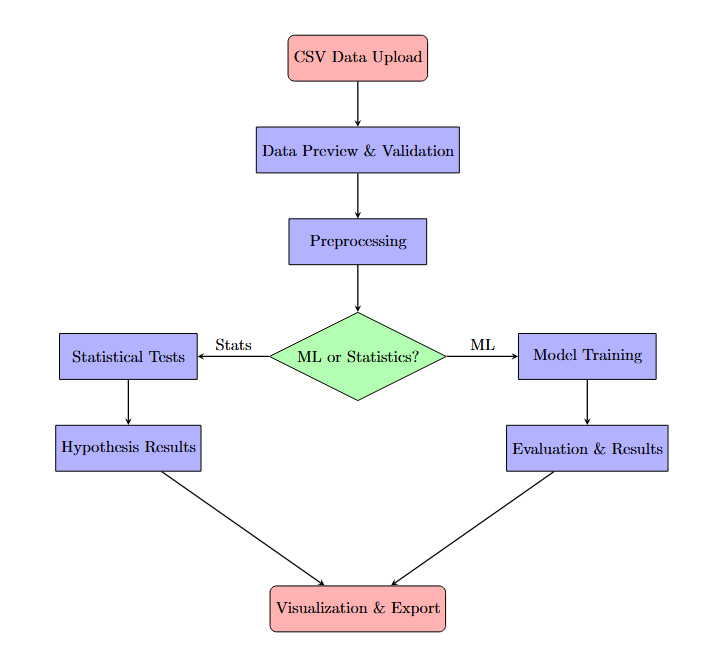

# Summary

Biological research increasingly relies on computational methods to analyze experimental data and predict molecular properties. Current approaches often require re- searchers to use disparate tools for statistical analysis and machine learning, creating workflow inefficiencies. We present an integrated platform that combines classical statistical methods with Random Forest classification for comprehensive chemical data analysis. The platform implements automated hyperparam- eter optimization, feature importance analysis, and a suite of statistical tests including t-tests, ANOVA, and Pearson correlation analysis. Our methodology addresses the gap between traditional statistical software and modern machine learning frameworks by providing a unified interface accessible to researchers without extensive programming experience. The system achieves this through automatic data preprocessing, categorical encoding, and adaptive model configuration based on dataset characteristics. Initial testing protocols are designed to evaluate classification accuracy across diverse chemical datasets with varying feature distributions. This work demonstrates that integrating statistical rigor with machine learning interpretability can accelerate chemical discovery workflows while maintaining methodological soundness. The platform’s modular architecture enables future extensions to additional machine learning algorithms and statistical procedures relevant to chemical informatics.

# Statement of Need

The contemporary landscape of chemical informatics research demands increasingly sophisticated computational approaches to extract meaningful insights from high-dimensional datasets [@Murphy2012; @Hastie2009; @VanderMaaten2008]. Researchers routinely encounter challenges when attempting to apply machine learning and statistical methods to chemical data: the proliferation of disparate software tools requires mastering multiple programming languages and environments [@Perkel2021]; the steep learning curve associated with libraries like scikit-learn [@Pedregosa2011] or R [@RCoreTeam2023] can be prohibitive for domain experts without formal computational training; and the lack of integrated platforms forces scientists to manually transfer data between incompatible systems, introducing opportunities for error and hindering reproducibility [@Baker2016].

While powerful frameworks exist for machine learning (scikit-learn, TensorFlow [@Abadi2016]) and statistical analysis (R, SciPy [@Virtanen2020]), these tools typically operate in isolation and require substantial programming proficiency. Jupyter notebooks [@Kluyver2016] have partially addressed integration concerns but still demand Python expertise and local software installation. Web-based alternatives like Orange [@Demsar2013] provide visual interfaces but often lack the flexibility and statistical rigor required for rigorous scientific inquiry. Furthermore, existing solutions rarely combine supervised learning, comprehensive hypothesis testing, and publication-quality visualization in a single, accessible platform.

This thus fills this methodological gap by providing a zero-installation, browser-based environment that unifies machine learning model development with parametric and non-parametric statistical testing. The platform specifically targets experimental chemists, biomedical researchers, and interdisciplinary scientists who possess domain expertise but may lack extensive computational backgrounds. By implementing Random Forest classification [@Breiman2001] alongside standard statistical tests (t-tests, Mann-Whitney U, correlation analyses), the software enables researchers to perform complete analytical workflows—from exploratory data analysis through predictive model deployment—within a single coherent interface. The use of modern web technologies (React, TypeScript, Vite) ensures broad accessibility across operating systems and devices while maintaining computational performance sufficient for typical research datasets (10³-10⁴ observations).

# Design and Features

## Software Architecture and Technology Stack

The tool employs a modern, component-based architecture built on the React framework (v18.3) with TypeScript for static type checking and enhanced code maintainability. The application is scaffolded using Vite (v5.x), a next-generation build tool that provides significantly faster hot module replacement during development and optimized production builds compared to traditional bundlers. This technological foundation ensures both developer productivity and end-user performance.

The frontend architecture adheres to the principle of separation of concerns through React's component model. Major functional modules—data ingestion, preprocessing, model training, statistical analysis, and visualization—are implemented as independent, composable components that communicate through props and shared state management. Styling is accomplished using Tailwind CSS (v3.x), a utility-first framework that enables rapid UI development while maintaining design consistency through a centralized configuration system. The component library leverages Radix UI primitives for accessible, unstyled base components that are then customized to match the application's design system.

Core scientific computing functionality is provided by specialized JavaScript libraries: `ml-random-forest` (v2.1) implements the Random Forest algorithm with support for both classification and regression; `papaparse` (v5.5) handles robust CSV parsing with automatic type inference and error recovery; and `recharts` (v2.15) generates interactive, SVG-based visualizations. State management follows React's built-in patterns (useState, useContext) supplemented by TanStack Query (v5.x) for asynchronous data operations. Routing is handled by React Router (v6.x), enabling a multi-page application structure within the single-page application paradigm.

## Data Processing Pipeline

The data ingestion system accepts CSV files through a drag-and-drop interface or file browser dialog. Upon upload, `papaparse` performs streaming parsing to handle large files efficiently, automatically detecting delimiters, quote characters, and data types. The parser generates a structured data object containing headers, row data, and metadata about the parsing process. Users can preview the first 100 rows in a sortable, scrollable table with column-wise summary statistics (mean, standard deviation, minimum, maximum, quartiles) computed using standard numerical algorithms.

Data validation occurs in multiple stages: the system checks for missing values and provides options for row-wise deletion or column-wise imputation; numerical columns are identified through type inspection and can be normalized using z-score standardization $x_{\\text{norm}} = \\frac{x - \\mu}{\\sigma}$ or min-max scaling $x_{\\text{scaled}} = \\frac{x - x_{\\min}}{x_{\\max} - x_{\\min}}$; categorical variables are automatically encoded using integer mapping. The preprocessing module generates a transformed dataset that serves as input to both machine learning and statistical analysis components.

## Machine Learning Implementation

The machine learning module implements Random Forest classification [@Breiman2001], an ensemble learning method that has demonstrated robust performance across diverse domains including chemical property prediction [@Svetnik2003] and drug discovery [@Darnag2010]. The implementation leverages the `ml-random-forest` JavaScript library, which provides a faithful adaptation of the original algorithm to the browser environment.

For a training dataset $\\mathcal{D} = \\{(\\mathbf{x}_i, y_i)\\}_{i=1}^{n}$ where $\\mathbf{x}_i \\in \\mathbb{R}^{p}$ represents a $p$-dimensional feature vector and $y_i \\in \\{0, 1\\}$ denotes the binary class label, the Random Forest constructs an ensemble of $T$ decision trees. Each tree $h_t$ is trained on a bootstrap sample $\\mathcal{D}_t^* \\subset \\mathcal{D}$ drawn with replacement, ensuring that approximately 63.2% of the original samples appear in each bootstrap replicate while the remaining 36.8% serve as out-of-bag (OOB) samples for internal validation.

The final prediction for a new observation $\\mathbf{x}$ is determined by majority voting:

$$\\hat{y}(\\mathbf{x}) = \\text{mode}\\{h_1(\\mathbf{x}), h_2(\\mathbf{x}), \\ldots, h_T(\\mathbf{x})\\}$$

At each node during tree construction, the algorithm randomly selects $m = \\lfloor\\sqrt{p}\\rfloor$ candidate features from the total $p$ features—a process known as feature bagging that decorrelates individual trees and reduces ensemble variance [@Hastie2009]. The optimal split point for node $S$ is determined by maximizing information gain based on the Gini impurity criterion:

$$G(S) = 1 - \\sum_{c=1}^{C} p_c^2$$

where $C$ is the number of classes and $p_c = \\frac{|\\{i \\in S : y_i = c\\}|}{|S|}$ represents the proportion of samples in node $S$ belonging to class $c$. The split that maximizes $\\Delta G = G(S_{\\text{parent}}) - \\left(\\frac{|S_{\\text{left}}|}{|S_{\\text{parent}}|}G(S_{\\text{left}}) + \\frac{|S_{\\text{right}}|}{|S_{\\text{parent}}|}G(S_{\\text{right}})\\right)$ is selected.

The platform exposes three key hyperparameters to users: (1) the number of trees $T$ (default: 100), which controls the ensemble size and typically exhibits diminishing returns beyond 100-500 trees; (2) maximum tree depth (default: unlimited), which constrains model complexity and can prevent overfitting; and (3) minimum samples per split (default: 2), which determines the stopping criterion for tree growth. Model training is performed asynchronously to maintain UI responsiveness, with progress updates displayed during the iterative tree construction process.

Model evaluation employs stratified random splitting to allocate 80% of samples to the training set and 20% to the test set, preserving class proportions in both subsets. Performance metrics are computed from the confusion matrix $\\mathbf{C}$ where $C_{ij}$ represents the number of observations with true label $i$ and predicted label $j$:

$$\\text{Accuracy} = \\frac{\\sum_{i} C_{ii}}{\\sum_{i,j} C_{ij}}, \\quad \\text{Precision}_c = \\frac{C_{cc}}{\\sum_{i} C_{ic}}, \\quad \\text{Recall}_c = \\frac{C_{cc}}{\\sum_{j} C_{cj}}$$

Feature importance scores are calculated as the mean decrease in Gini impurity across all trees, normalized to sum to unity. These scores provide interpretable insights into which chemical descriptors most strongly influence classification decisions.

## Statistical Hypothesis Testing

Beyond predictive modeling, ChemML Analytics incorporates a comprehensive suite of statistical hypothesis tests essential for exploratory data analysis and comparative studies. The statistical module supports both parametric tests (which assume specific distributional forms) and non-parametric alternatives (which make minimal distributional assumptions).

For comparing means between two independent groups, the platform implements Welch's t-test [@Welch1947], which does not assume equal population variances—a common violation in real-world chemical data. The test statistic is:

$$t = \\frac{\\bar{X}_1 - \\bar{X}_2}{\\sqrt{\\frac{s_1^2}{n_1} + \\frac{s_2^2}{n_2}}}$$

with degrees of freedom approximated by the Welch-Satterthwaite equation:

$$\\nu \\approx \\frac{\\left(\\frac{s_1^2}{n_1} + \\frac{s_2^2}{n_2}\\right)^2}{\\frac{(s_1^2/n_1)^2}{n_1-1} + \\frac{(s_2^2/n_2)^2}{n_2-1}}$$

where $\\bar{X}_i$, $s_i^2$, and $n_i$ denote the sample mean, variance, and size for group $i$. P-values are computed using the Student's t-distribution with $\\nu$ degrees of freedom.

As a non-parametric alternative, the Mann-Whitney U test (also known as the Wilcoxon rank-sum test) [@Mann1947] assesses whether two samples are drawn from the same distribution by comparing rank sums. The test statistic is:

$$U = n_1 n_2 + \\frac{n_1(n_1+1)}{2} - R_1$$

where $R_1$ is the sum of ranks assigned to the first sample after pooling and ranking all observations. For sample sizes above 20, the distribution of $U$ is well-approximated by a normal distribution with mean $\\mu_U = \\frac{n_1 n_2}{2}$ and variance $\\sigma_U^2 = \\frac{n_1 n_2 (n_1 + n_2 + 1)}{12}$.

For assessing relationships between continuous variables, the platform computes Pearson's correlation coefficient [@Pearson1895]:

$$r_{xy} = \\frac{\\sum_{i=1}^{n}(x_i - \\bar{x})(y_i - \\bar{y})}{\\sqrt{\\sum_{i=1}^{n}(x_i - \\bar{x})^2} \\sqrt{\\sum_{i=1}^{n}(y_i - \\bar{y})^2}}$$

which quantifies the linear association between variables $X$ and $Y$. For non-linear monotonic relationships or data with outliers, Spearman's rank correlation coefficient $\\rho$ [@Spearman1904] is calculated by applying Pearson's formula to rank-transformed data. Statistical significance is evaluated using the t-statistic $t = r\\sqrt{\\frac{n-2}{1-r^2}}$ with $n-2$ degrees of freedom.

All hypothesis tests report p-values, effect sizes, and confidence intervals where applicable. The interface provides guidance on assumption checking and appropriate test selection based on data characteristics (sample size, distributional shape, variance homogeneity).

## Interactive Visualization System

ChemML Analytics employs the Recharts library to generate publication-quality, interactive visualizations rendered as scalable vector graphics (SVG). The visualization suite includes: (1) scatter plots with customizable axes and color-coded classes for exploring bivariate relationships; (2) histograms with adjustable bin widths for examining feature distributions; (3) box-and-whisker plots displaying quartiles, outliers, and distributional symmetry; (4) bar charts for feature importance rankings; (5) confusion matrices as annotated heatmaps; and (6) correlation matrices with diverging color schemes to highlight positive and negative associations.

All visualizations support interactive features including hover tooltips displaying precise values, zoom and pan controls for detailed inspection, and legend toggling to isolate specific series. Plots can be exported as PNG images for incorporation into manuscripts and presentations. The charting system automatically handles responsive resizing to accommodate various screen sizes and device orientations.

## User Workflow and Interface Design

\autoref{fig:workflow} illustrates the complete analysis workflow. The application employs a tab-based navigation structure that mirrors the typical data analysis workflow: Data Upload → Model Training → Results → Statistical Analysis. Each module presents a focused interface with contextual help text and parameter descriptions. Form inputs include validation with real-time feedback to prevent invalid configurations (e.g., negative tree counts, training-test splits outside [0,1]).

The Data Upload tab provides drag-and-drop file selection and displays a preview table with scrollable columns and sortable headers. Summary statistics are computed on-demand for numerical columns. The Model Training tab exposes hyperparameter controls with sensible defaults and initiates asynchronous training with a progress indicator. Upon completion, the Results tab renders performance metrics, visualizations, and a downloadable model file (JSON format) for future predictions. The Statistical Analysis tab allows users to select variables and test types through dropdown menus, then displays results in formatted tables with interpretive guidance.

Model versioning enables users to train multiple configurations and compare performance side-by-side. Each trained model is stored in browser local storage (up to 5MB per domain) with metadata including timestamp, hyperparameters, and accuracy scores. This feature facilitates hyperparameter tuning and model selection without re-running lengthy computations.

# Future Development Directions

Several enhancements are planned to extend the platform's capabilities and broaden its applicability. On the machine learning front, we intend to implement additional algorithms including Support Vector Machines [@Cortes1995], Gradient Boosting [@Friedman2001], and Neural Networks to provide users with algorithm selection options suited to different data characteristics. Cross-validation frameworks (k-fold, stratified, leave-one-out) will enable more robust performance estimation beyond simple train-test splits. Automated hyperparameter optimization using grid search, random search, or Bayesian optimization [@Bergstra2012] would reduce the manual tuning burden.

Integration with chemical structure visualization libraries (e.g., RDKit.js) would allow users to view molecular structures alongside their predictions, enhancing interpretability for medicinal chemists. Statistical capabilities will expand to include analysis of variance (ANOVA) for multi-group comparisons, multivariate techniques such as principal component analysis (PCA) and partial least squares (PLS), and time-series methods for longitudinal or kinetic data.

On the technical infrastructure side, we plan to implement server-side computation options for datasets exceeding browser memory limits, user authentication for saving analyses across sessions, and collaborative features enabling team-based projects. Enhanced export functionality will support batch predictions on new datasets and generation of automated analysis reports in PDF format.

# Acknowledgements

The authors acknowledge the Department of Biomedical Engineering and the Department of Chemistry and Chemical Biology at Stevens Institute of Technology for computational resources and institutional support.

# References
